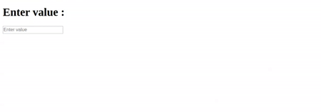

# AngularJS - Text Box Component

A AngularJS based Text Box component used to specify an input field where the user can enter data.

## Table of contents

- [Browser Support](#browser-support)
- [Demo](#demo)
- [Getting started](#getting-started)
- [Usage](#usage)
- [Available Props](#available-props)
- [Methods](#methods)
- [Want to Contribute?](#want-to-contribute)
- [Collection of Components](#collection-of-components)
- [Changelog](#changelog)
- [License](#license)
- [Keywords](#Keywords)

## Browser Support

|  |  |  |  |  |
| ---------------------------------------------------------------------------------------- | ------------------------------------------------------------------------------------------- | ---------------------------------------------------------------------------------------- | ---------------------------------------------------------------------------------- | ---------------------------------------------------------------------------------------------------------------------------- |
| 83.0 ✔                                                                                   | 77.0 ✔                                                                                      | 13.1.1 ✔                                                                                 | 83.0 ✔                                                                             | 11.9 ✔                                                                                                                       |

## Demo

[](https://github.com/weblineindia/AngularJS-Text-Box/textNg.gif)

## Getting started

Install the npm package:

```bash
npm install angular-weblineindia-text-box
#OR
yarn add angular-weblineindia-text-box
```

## Usage

Use the `<angular-weblineindia-text-box>` component:

Add in app.module.ts file

```typescript
import { NgModule } from "@angular/core";
import { TextModule } from "angular-weblineindia-text-box";

@NgModule({
  imports: [TextModule]
})
export class AppModule {}
```
Add in app.component.ts file

```typescript
export class AppComponent {
  textBoxValue: any = {
    placeholder: "Enter value",
    value: "",
    id: "textbox",
    name: "textbox",
    tabindex: 0,
    disabled: false,
    type: "text",
    maxLength: 10,
    isnumberonly: false,
    className: { "form-control": true },
    regex: /^[A-Za-z0-9_ ]*$/
  };

  onChangeText(event) {
    if (this.textBoxValue.isnumberonly) {
      this.textBoxValue.value = event.target.value.replace(/^[0-9\b]+$/, "");
    } else {
      if (event.target.value.trim().length === 0) {
        this.textBoxValue.value = event.target.value.trim();
      } else {
        let regex = /^[A-Za-z0-9_ ]*$/;
        this.textBoxValue.value = event.target.value.replace(regex, "");
      }
    }
  }

  onFocusText(event) {
    event.target.placeholder = "";
  }
  onBlurText(event) {
    event.target.placeholder = this.textBoxValue.placeholder;
  }
  onKeyDownText(event) {}
  onKeyPressText(event) {}
  onKeyUpText(event) {}
}
```
Add in app.component.html file

```html
<lib-text
  [placeholder]="textBoxValue.placeholder"
  [name]="textBoxValue.name"
  [value]="textBoxValue.value"
  [id]="textBoxValue.id"
  [disabled]="textBoxValue.disabled"
  [tabindex]="textBoxValue.tabindex"
  [maxLength]="textBoxValue.maxLength"
  [isnumberonly]="textBoxValue.isnumberonly"
  [className]="textBoxValue.className"
  [regex]="textBoxValue.regex"
  (change)="onChangeText($event)"
  (focus)="onFocusText($event)"
  (blur)="onBlurText($event)"
  (KeyDown)="onKeyDownText($event)"
  (KeyPress)="onKeyPressText($event)"
  (KeyUp)="onKeyUpText($event)"
>
</lib-text>
```

## Available Props

| Prop         | Type    | default | Description                                    |
| ------------ | ------- | ------- | ---------------------------------------------- |
| id           | String  |         | ID for the input                               |
| name         | String  |         | Nam for the input                              |
| value        | string  |         | Value of the component                         |
| classname    | object  |         | Class to the input                             |
| placeholder  | String  |         | The input field will get this placeholder text |
| disabled     | Boolean | false   | Disable component                              |
| tabindex     | Number  | 0       | Tab index of the component                     |
| maxlength    | Number  | 25      | The input maxlength                            |
| regex        | RegExp  |         | The input regex                                |
| autocomplete | String  | off     | The input of autocomplelete                    |
| type         | String  | text    | Type for the input                             |
| isnumberonly | Boolean | false   | The input field will get number value          |

## Methods

| Name       | Description                                                      |
| ---------- | ---------------------------------------------------------------- |
| focus    | Gets triggered when the autocomplete input field receives focus. |
| blur     | Gets triggered when the autocomplete input field loses focus.    |
| change   | Gets triggered when the autocomplete results got changed.        |
| KeyPress | Gets triggered when a key gets pressed.                          |
| KeyDown  | Gets triggered when a key gets down.                             |
| KeyUp    | Gets triggered when a key gets up.                               |

## Want to Contribute?

- Created something awesome, made this code better, added some functionality, or whatever (this is the hardest part).
- [Fork it](http://help.github.com/forking/).
- Create new branch to contribute your changes.
- Commit all your changes to your branch.
- Submit a [pull request](http://help.github.com/pull-requests/).

---

## Collection of Components

We have built many other components and free resources for software development in various programming languages. Kindly click here to view our [Free Resources for Software Development](https://www.weblineindia.com/software-development-resources.html)

---

## Changelog

Detailed changes for each release are documented in [CHANGELOG.md](./CHANGELOG.md).

## License

[MIT](LICENSE)

[mit]: https://github.com/weblineindia/AngularJS-Text-Box/blob/master/LICENSE

## Keywords

angular-weblineindia-text-box, textbox, input, angular, angular-component, textbox-component, textarea, text-box-input
